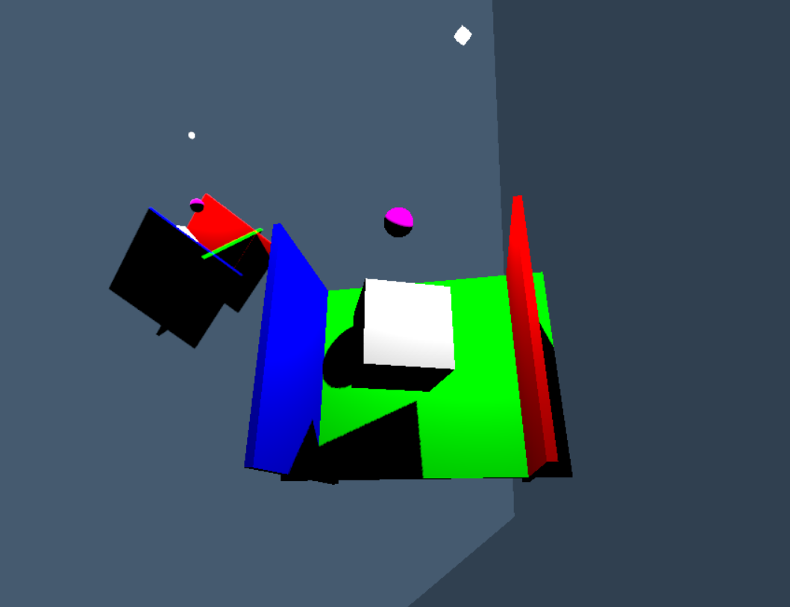

# room
A dynamic 3D environment involving shadows and reflections made in three.js.
## How to run
Open the terminal and run these commands:

1. Cloning the repository:
   ```
   git clone https://github.com/liminaclus/room.git
   ```
2. Go into the folder:
   ```
   cd room
   ```
3. Install dependencies:
   ```
   npm install
   ```
4. Run the web app:
   ```
   npm run dev
   ```
5. Now just type in the terminal:
   ```
   o
   ```
   and hit enter.

   The web app will open up in the browser. You can interact with it using your mouse or trackpad.


